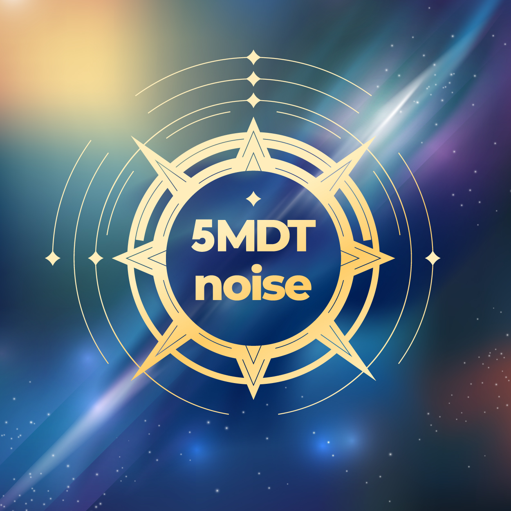

# 5mdt Noise Generator




## Description

The 5mdt Noise Generator is a web-based application that generates different types of noises locally, including brown, white, and pink noise. It allows users to play these noises and control their volume.

There is no tracking, ads or even cookies here. It's absolutely free to use and modify.

## Demo


- [On Github Pages](https://5mdt.github.io/noise/)

## Installation

To use the 5mdt Noise Generator, simply open the `index.html` file in a web browser. No additional installation is required.

## Usage

1. Open the `index.html` file in your web browser.
2. Click on the "Play Brown Noise," "Play White Noise," or "Play Pink Noise" buttons to start playing the corresponding noise type.
3. Adjust the volume as needed using the system controls.
   To stop the noise, close the browser tab, or press the "Stop Noise" button.

## Development

Unfortunately due to the separated `index.html` and `RandomNoiseProcessor.js` opening html file in the browser triggers CORS errors. You can serve nginx on a local port with the following command

```bash
docker run -it --rm -v $PWD:/usr/share/nginx/html/ -p 8081:80 nginx:alpine
```

- Please use 4 spaces tabulation

## License

This project is licensed under the [MIT License](LICENSE).

## Authors (alphabetically)

- [@akamenskiy](https://github.com/akamenskiy) (JS)
- [@asyavee](https://github.com/asyavee) (JS)
- [@kawaiier](https://github.com/kawaiier) (CSS)
- [@nett00n](https://github.com/nett00n) (Maintainer)
- [Belka](https://www.behance.net/levichevatn) (Logo)

---

2023
